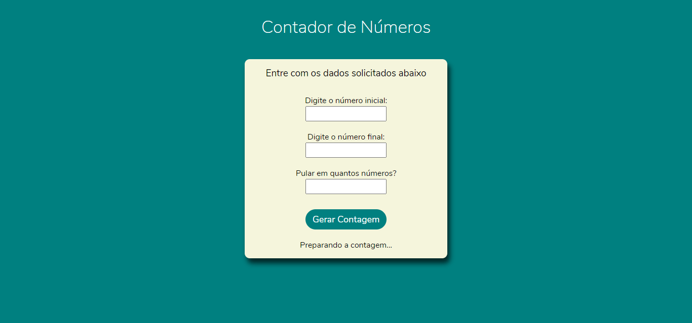
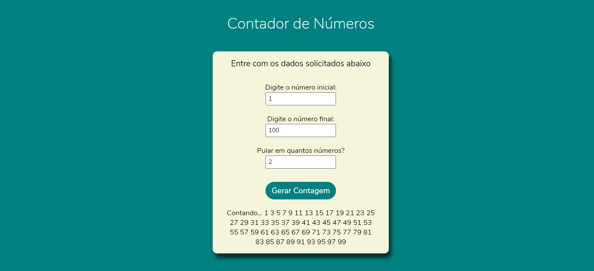
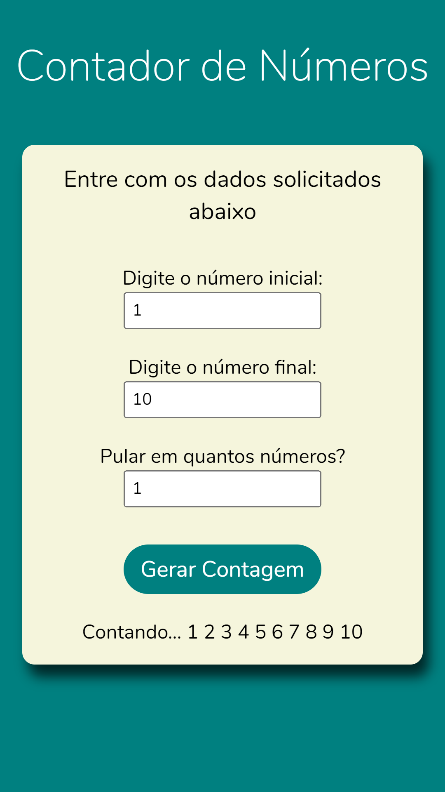
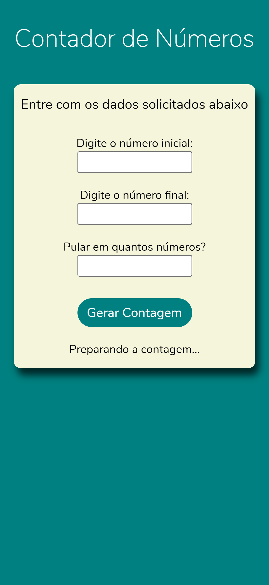

# Contador de Números

Elaboração de um contador simples de números. Teste o projeto livremente clicando neste link - [Contador de Números](https://victordlmoraes.github.io/contador-de-numeros/)

## Guia
- [Descrição](#ancora1)
- [Tratamento de Possíveis Erros](#ancora2)
- [Screenshots](#ancora3)

## :pushpin: Descrição

Este contador permite realizar contagens de números simples, através de dois valores definidos pelo usuário, um inicial e outro final. O usuário também poderá definir o **salto da contagem** (se deseja contar de um em um, dois em dois, seis a cada seis, etc.). É possível realizar a contagem a partir de um número negativo, basta defini-lo no campo inicial.

Também é possível ao usuário escolher uma contagem **crescente ou decrescente**. Para uma contagem decrescente, basta que o usuário defina que o número final da contagem seja **menor** que o número inicial.

Após a contagem ser definida, todos os números da sequência determinada pelo usuário serão exibidos, logo abaixo do botão responsável por gerar a contagem.

[Voltar ao Topo](#ancora)

## :warning: Tratamento de Possíveis Erros

No contador, também são feitas algumas verificações para o caso de erros por parte do usuário. Caso o usuário não entre com um dos valores pedidos pelo contador, será mostrado um alerta de erro na tela, solicitando a verificação dos dados. Caso o salto tenha valor **zero ou negativo**, a contagem não é realizada, e outro alerta de erro é apontado. Porém, nesse caso, **o contador automaticamente irá considerar o valor do salto como 1**.

[Voltar ao Topo](#ancora)

## :camera_flash: Screenshots

### :desktop_computer: Versão Desktop

[Voltar ao Topo](#ancora)

### :iphone: Versão Mobile
#### Moto G4

  

#### Iphone X

  

[Voltar ao Topo](#ancora)
